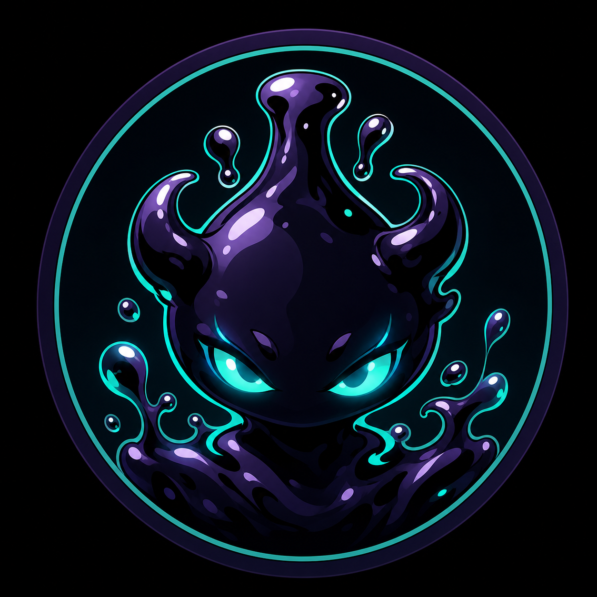
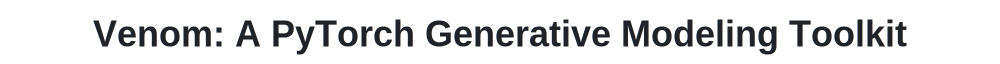

<p align="center">
  <br>
  
</p>

<p align="center">
  <a href="https://divinyan.com/Venom/">
    
  </a>
  <a href="https://arxiv.org/html/2605.17605v1">
    
  </a>
  <a href="LICENSE">
    
  </a>
</p>

<p align="center">
  The official implementation accompanying the arXiv paper
  <em>Venom: A PyTorch Generative Modeling Toolkit</em>.
</p>

<p align="center">
  Liang Yan<br>
  <strong>arXiv preprint arXiv:2605.17605, 2026</strong>
</p>

Venom is an educational PyTorch package for modern generative modeling. It
collects diffusion and score/SDE models, flow-matching models, one-step
generation methods, normalizing flows, foundational image VAEs, foundational
image GANs, and energy-based models under one small MNIST-first codebase.

The default dataset is MNIST so every implementation stays easy to read,
modify, and benchmark before scaling to larger image datasets.

## Supported Diffusion Models

Diffusion, score, flow, and one-step models live under `venom.diffusion`.

| Family | `--variant` | What is trained |
|---|---|---|
| DDPM | `ddpm` | Epsilon-prediction DDPM with a linear beta schedule and fixed posterior variance. |
| Improved DDPM | `improved-ddpm` | DDPM with cosine schedule and learned-range variance. |
| ADM / Guided Diffusion | `adm` | Class-conditional DDPM-family model with learned-range variance. |
| Classifier-Free Guidance | `cfg` | Class-conditional DDPM-family model with null-label dropout for CFG sampling. |
| EDM | `edm` | EDM/Karras denoising objective with continuous noise levels. |
| NCSN | `ncsn` | Noise Conditional Score Network objective over discrete geometric noise scales. |
| NCSNv2 | `ncsnv2` | Improved NCSN-style denoising score matching. |
| Score SDE | `score-sde-vp` | Continuous-time VP-SDE score model. |
| Score SDE | `score-sde-ve` | Continuous-time VE-SDE score model. |
| Score SDE | `score-sde-subvp` | Continuous-time sub-VP-SDE score model. |
| PFGM | `pfgm` | Poisson-flow-style perturbation model. |
| PFGM++ | `pfgm++` | PFGM++ perturbation kernel with EDM-style preconditioning. |
| Rectified Flow | `rectified-flow` | Velocity field from noise to data along straight paths. |
| Flow Matching | `flow-matching` | Continuous velocity field with stochastic path perturbations. |
| Conditional Flow Matching | `conditional-flow-matching` | Conditional flow-matching path objective. |
| OT-CFM | `ot-cfm` | Conditional flow matching with lightweight minibatch OT pairing. |
| Stochastic Interpolants | `stochastic-interpolants` | Noisy interpolating paths with explicit path derivatives. |
| Consistency Models | `consistency` | One/few-step consistency objective with EDM-style preconditioning. |
| Shortcut Models | `shortcut` | Flow model conditioned on the requested integration step size. |
| MeanFlow | `meanflow` | Average-velocity objective for one-step or few-step generation. |

## Supported VAE Models

VAE models live under `venom.vae` and use a separate MNIST training entrypoint.

| Family | `--variant` | What is trained |
|---|---|---|
| VAE | `vae` | Fully connected Gaussian-latent VAE baseline. |
| ConvVAE | `conv-vae` | Convolutional image VAE with Gaussian latent variables. |
| Beta-VAE | `beta-vae` | ConvVAE with a stronger KL penalty controlled by `--beta`. |
| CVAE | `cvae` | Class-conditional ConvVAE for label-conditioned image generation. |
| IWAE | `iwae` | ConvVAE trained with an importance-weighted lower bound. |
| VQ-VAE | `vq-vae` | Discrete codebook VAE with vector quantization. |
| Ladder / Hierarchical VAE | `ladder-vae`, `hierarchical-vae` | Two-level latent hierarchy for multi-scale image modeling. |
| Flow-VAE | `flow-vae` | ConvVAE with planar normalizing flows in the posterior. |

## Supported Flow-Based Models

Normalizing flows live under `venom.flows`. These are likelihood-based
invertible models, separate from flow matching and rectified flow in
`venom.diffusion.flow_matching`.

| Family | `--variant` | What is trained |
|---|---|---|
| Planar Flow | `planar-flow` | Stacked planar transforms with fixed-point inverse for sampling. |
| Radial Flow | `radial-flow` | Stacked radial transforms with fixed-point inverse for sampling. |
| NICE | `nice` | Additive coupling flow with exact inverse and unit log-determinant. |
| RealNVP | `realnvp` | Affine coupling flow with exact likelihood and sampling. |
| Glow-lite | `glow` | ActNorm + invertible linear transform + affine coupling. |
| MAF | `maf` | Masked autoregressive flow for density estimation. |
| IAF | `iaf` | Inverse-autoregressive educational flow. |
| Neural Spline Flow | `neural-spline-flow` | Monotone spline-style coupling transform. |
| FFJORD-lite / CNF | `ffjord` | Continuous normalizing flow with Hutchinson trace estimates. |
| Flow++-style | `flow++` | ActNorm + invertible linear transform + nonlinear coupling. |

## Supported GAN Models

GAN models live under `venom.gan` and use a separate MNIST training entrypoint.

| Family | `--variant` | What is trained |
|---|---|---|
| GAN | `gan` | Original MLP generator/discriminator with the vanilla minimax/BCE loss. |
| DCGAN | `dcgan` | Convolutional generator and discriminator for image GAN training. |
| CGAN | `cgan` | Label-conditional DCGAN with class embeddings in generator and discriminator. |
| ACGAN | `acgan` | Conditional GAN with an auxiliary classifier head in the discriminator. |
| InfoGAN | `infogan` | GAN with a latent code prediction head and mutual-information-style code loss. |
| LSGAN | `lsgan` | DCGAN architecture trained with least-squares adversarial loss. |
| WGAN | `wgan` | Wasserstein critic objective with weight clipping. |
| WGAN-GP | `wgan-gp` | Wasserstein critic objective with gradient penalty. |
| HingeGAN | `hinge-gan` | DCGAN architecture trained with hinge adversarial loss. |
| SNGAN | `sn-gan` | Hinge GAN with spectral normalization in the discriminator. |

## Supported Energy-Based Models

EBM models live under `venom.ebm` and use a separate MNIST training entrypoint.

| Family | `--variant` | What is trained |
|---|---|---|
| RBM | `rbm` | Bernoulli-Bernoulli restricted Boltzmann machine with CD/PCD. |
| Gaussian RBM | `gaussian-rbm` | Gaussian visible units with Bernoulli hidden units. |
| Conditional RBM | `conditional-rbm` | Label-conditioned RBM with class-dependent visible and hidden biases. |
| ConvRBM | `conv-rbm` | Convolutional RBM for image-structured energies. |
| Deep EBM | `deep-ebm` | CNN scalar energy model trained with SGLD negatives. |
| Conditional Deep EBM | `conditional-ebm` | Class-conditional CNN energy `E(x, y)`. |
| JEM | `jem` | Joint energy model using classifier logits as energies. |
| Score Matching EBM | `score-matching-ebm` | CNN energy trained with denoising score matching. |
| Sliced Score Matching EBM | `sliced-score-matching-ebm` | CNN energy trained with sliced score matching. |
| NCE-EBM | `nce-ebm` | CNN energy trained with noise-contrastive estimation. |

## Supported Samplers

| Sampler | CLI option | Compatible checkpoints | Notes |
|---|---|---|---|
| DDPM ancestral sampler | `--sampler ddpm` | DDPM-family checkpoints | Full stochastic reverse diffusion chain. |
| DDIM sampler | `--sampler ddim` | DDPM-family checkpoints | Deterministic when `--eta 0`; stochastic when `--eta > 0`. |
| DPM-Solver | `--sampler dpm-solver` | DDPM-family checkpoints | Fast first-order noise-prediction ODE sampler. |
| DPM-Solver++ | `--sampler dpm-solver++` | DDPM-family checkpoints | Fast first-order data-prediction ODE sampler. |
| EDM/Karras sampler | native | `edm`, `pfgm`, `pfgm++` | Euler/Heun sampling over Karras noise levels. |
| Score SDE PC sampler | native | `score-sde-*` | Predictor-corrector sampling for VP/VE/sub-VP SDEs. |
| Annealed Langevin sampler | native | `ncsn`, `ncsnv2` | Langevin dynamics across the score network noise ladder. |
| Flow ODE sampler | native | flow-matching variants | Euler/Heun integration from noise to data. |
| One-step/few-step sampler | native | `consistency`, `shortcut`, `meanflow` | One-step by default; can use more steps with `--sample-steps`. |
| Gibbs sampler | native | RBM-family EBM checkpoints | Alternating visible/hidden conditional sampling. |
| Langevin / SGLD sampler | native | deep EBM and JEM checkpoints | Gradient-based MCMC in image space. |
| Inverse flow sampler | native | normalizing flow checkpoints | Samples by drawing Gaussian latents and applying inverse transforms. |

When `--sampler native` is used, Venom automatically selects the natural sampler
for the checkpoint family. DDPM-family checkpoints default to DDIM.

## Supported Guidance and Conditioning

| Method | How to train | How to sample | Supported variants |
|---|---|---|---|
| Class conditioning | `--variant adm` | pass `--labels 0,1,2,...` | `adm` |
| Classifier guidance | train classifier with `python -m venom.diffusion.train_classifier_mnist` | pass `--classifier-checkpoint` and `--classifier-scale` | DDPM/ADM-style ancestral sampling |
| Classifier-free guidance | `--variant cfg --class-dropout 0.1` | pass `--labels` and `--guidance-scale` | `cfg` with DDIM, DPM-Solver, or DPM-Solver++ |
| Conditional DiT backbone | add `--backbone dit` to conditional variants | same as the selected objective | `adm`, `cfg`, and other label-aware modules when labels are provided |

## Supported Backbones

| Backbone | CLI option | Notes |
|---|---|---|
| ADM-style U-Net | `--backbone unet` | Default backbone for all MNIST experiments. |
| Small DiT | `--backbone dit` | Patch-token transformer backbone for MNIST-sized images. |

## Install

```bash
python -m venv .venv
source .venv/bin/activate
pip install -e .
```

If you prefer requirements only:

```bash
pip install -r requirements.txt
```

## Notebooks

Venom includes two Jupyter notebooks that walk through the package API and
project KPIs: training, checkpointing, sampling, guidance, conditioning, and
family-specific usage.

| Notebook | Language | Use case |
|---|---|---|
| [`notebooks/venom_api_kpi_tutorial.ipynb`](notebooks/venom_api_kpi_tutorial.ipynb) | Chinese | Chinese walkthrough for diffusion, VAE, normalizing flows, GAN, EBM, and guidance workflows. |
| [`notebooks/venom_api_kpi_tutorial_en.ipynb`](notebooks/venom_api_kpi_tutorial_en.ipynb) | English | English walkthrough with the same training, sampling, KPI, API, and guidance examples. |

## Train MNIST Examples

Diffusion, score, flow, and one-step training:

```bash
# Original DDPM
python train_diffusion.py --variant ddpm --epochs 5

# Improved DDPM: cosine schedule + learned-range variance
python train_diffusion.py --variant improved-ddpm --epochs 5

# ADM-style class-conditional model
python train_diffusion.py --variant adm --epochs 5

# Classifier-free guidance model
python train_diffusion.py --variant cfg --epochs 5 --class-dropout 0.1

# EDM objective and Karras sampler
python train_diffusion.py --variant edm --epochs 5 --sample-steps 32

# NCSN / NCSNv2 score matching
python train_diffusion.py --variant ncsn --epochs 5
python train_diffusion.py --variant ncsnv2 --epochs 5

# Continuous-time Score SDE variants
python train_diffusion.py --variant score-sde-vp --epochs 5 --sample-steps 250
python train_diffusion.py --variant score-sde-ve --epochs 5 --sample-steps 250
python train_diffusion.py --variant score-sde-subvp --epochs 5 --sample-steps 250

# PFGM / PFGM++
python train_diffusion.py --variant pfgm --epochs 5 --sample-steps 32
python train_diffusion.py --variant pfgm++ --epochs 5 --sample-steps 32

# Flow and interpolant models
python train_diffusion.py --variant rectified-flow --epochs 5 --sample-steps 50
python train_diffusion.py --variant flow-matching --epochs 5 --sample-steps 50
python train_diffusion.py --variant conditional-flow-matching --epochs 5 --sample-steps 50
python train_diffusion.py --variant ot-cfm --epochs 5 --sample-steps 50
python train_diffusion.py --variant stochastic-interpolants --epochs 5 --sample-steps 50

# One-step and few-step families
python train_diffusion.py --variant consistency --epochs 5 --sample-steps 1
python train_diffusion.py --variant shortcut --epochs 5 --sample-steps 1
python train_diffusion.py --variant meanflow --epochs 5 --sample-steps 1

# Swap the U-Net for a small DiT backbone
python train_diffusion.py --variant ddpm --backbone dit --epochs 5
python train_diffusion.py --variant rectified-flow --backbone dit --epochs 5
python train_diffusion.py --variant meanflow --backbone dit --epochs 5
```

Progressive distillation starts from a trained DDPM-family teacher:

```bash
python -m venom.diffusion.train_progressive_distill_mnist \
  --teacher-checkpoint runs/mnist_diffusion/improved-ddpm/model_005.pt \
  --student-steps 50 \
  --epochs 3
```

Checkpoints and preview grids are written to `runs/mnist_diffusion/<variant>/`.

VAE training:

```bash
# Fully connected VAE and convolutional VAE
python train_vae.py --variant vae --epochs 5
python train_vae.py --variant conv-vae --epochs 5

# Beta-VAE, CVAE, and IWAE
python train_vae.py --variant beta-vae --beta 4.0 --epochs 5
python train_vae.py --variant cvae --epochs 5
python train_vae.py --variant iwae --importance-samples 5 --epochs 5

# VQ-VAE, hierarchical VAE, and Flow-VAE
python train_vae.py --variant vq-vae --codebook-size 512 --epochs 5
python train_vae.py --variant ladder-vae --epochs 5
python train_vae.py --variant flow-vae --epochs 5
```

VAE checkpoints and preview grids are written to `runs/mnist_vae/<variant>/`.

Normalizing flow training:

```bash
# Coupling and autoregressive flows
python train_flow.py --variant nice --epochs 5
python train_flow.py --variant realnvp --epochs 5
python train_flow.py --variant glow --epochs 5
python train_flow.py --variant maf --epochs 5
python train_flow.py --variant iaf --epochs 5

# Early and nonlinear flow transforms
python train_flow.py --variant planar-flow --epochs 5
python train_flow.py --variant radial-flow --epochs 5
python train_flow.py --variant neural-spline-flow --epochs 5

# Continuous and Flow++-style flows
python train_flow.py --variant ffjord --epochs 5
python train_flow.py --variant flow++ --epochs 5
```

Flow checkpoints and preview grids are written to `runs/mnist_flow/<variant>/`.

GAN training:

```bash
# Original GAN and DCGAN
python train_gan.py --variant gan --epochs 5
python train_gan.py --variant dcgan --epochs 5

# Conditional and information-theoretic GANs
python train_gan.py --variant cgan --epochs 5
python train_gan.py --variant acgan --epochs 5
python train_gan.py --variant infogan --epochs 5

# Loss/stability variants
python train_gan.py --variant lsgan --epochs 5
python train_gan.py --variant wgan --epochs 5
python train_gan.py --variant wgan-gp --epochs 5
python train_gan.py --variant hinge-gan --epochs 5
python train_gan.py --variant sn-gan --epochs 5
```

GAN checkpoints and preview grids are written to `runs/mnist_gan/<variant>/`.

EBM training:

```bash
# RBM-family models with contrastive divergence
python train_ebm.py --variant rbm --epochs 5
python train_ebm.py --variant gaussian-rbm --epochs 5
python train_ebm.py --variant conditional-rbm --epochs 5
python train_ebm.py --variant conv-rbm --epochs 5

# Modern neural EBMs
python train_ebm.py --variant deep-ebm --epochs 5
python train_ebm.py --variant conditional-ebm --epochs 5
python train_ebm.py --variant jem --epochs 5

# Partition-function-free estimators
python train_ebm.py --variant score-matching-ebm --epochs 5
python train_ebm.py --variant sliced-score-matching-ebm --epochs 5
python train_ebm.py --variant nce-ebm --epochs 5
```

EBM checkpoints and preview grids are written to `runs/mnist_ebm/<variant>/`.

## Sample MNIST Examples

```bash
python sample_diffusion.py \
  --checkpoint runs/mnist_diffusion/ddpm/model_005.pt \
  --sampler ddim \
  --sample-steps 50 \
  --num-samples 64 \
  --out samples.png
```

Fast samplers for DDPM-family checkpoints:

```bash
python sample_diffusion.py --checkpoint runs/mnist_diffusion/improved-ddpm/model_005.pt --sampler dpm-solver --sample-steps 20
python sample_diffusion.py --checkpoint runs/mnist_diffusion/improved-ddpm/model_005.pt --sampler dpm-solver++ --sample-steps 20
```

Classifier-free guidance:

```bash
python sample_diffusion.py \
  --checkpoint runs/mnist_diffusion/cfg/model_005.pt \
  --sampler dpm-solver++ \
  --sample-steps 20 \
  --labels 0,1,2,3,4,5,6,7,8,9 \
  --guidance-scale 3.0
```

Continuous-time checkpoints use their native samplers:

```bash
python sample_diffusion.py --checkpoint runs/mnist_diffusion/edm/model_005.pt --sample-steps 32
python sample_diffusion.py --checkpoint runs/mnist_diffusion/score-sde-ve/model_005.pt --sample-steps 250
python sample_diffusion.py --checkpoint runs/mnist_diffusion/pfgm++/model_005.pt --sample-steps 32
python sample_diffusion.py --checkpoint runs/mnist_diffusion/rectified-flow/model_005.pt --sample-steps 50
python sample_diffusion.py --checkpoint runs/mnist_diffusion/meanflow/model_005.pt --sample-steps 1
```

VAE checkpoints use `sample_vae.py`:

```bash
python sample_vae.py --checkpoint runs/mnist_vae/conv-vae/model_005.pt --num-samples 64
python sample_vae.py --checkpoint runs/mnist_vae/cvae/model_005.pt --labels 0,1,2,3,4,5,6,7,8,9
```

Normalizing flow checkpoints use `sample_flow.py`:

```bash
python sample_flow.py --checkpoint runs/mnist_flow/realnvp/model_005.pt --num-samples 64
python sample_flow.py --checkpoint runs/mnist_flow/glow/model_005.pt --num-samples 64
python sample_flow.py --checkpoint runs/mnist_flow/neural-spline-flow/model_005.pt --num-samples 64
```

GAN checkpoints use `sample_gan.py`:

```bash
python sample_gan.py --checkpoint runs/mnist_gan/dcgan/model_005.pt --num-samples 64
python sample_gan.py --checkpoint runs/mnist_gan/cgan/model_005.pt --labels 0,1,2,3,4,5,6,7,8,9
```

EBM checkpoints use `sample_ebm.py`:

```bash
python sample_ebm.py --checkpoint runs/mnist_ebm/rbm/model_005.pt --steps 100
python sample_ebm.py --checkpoint runs/mnist_ebm/deep-ebm/model_005.pt --steps 100
python sample_ebm.py --checkpoint runs/mnist_ebm/conditional-ebm/model_005.pt --labels 0,1,2,3,4,5,6,7,8,9
```

## Classifier Guidance

Train a timestep-conditioned noised classifier:

```bash
python -m venom.diffusion.train_classifier_mnist --epochs 3
```

Then sample a class-conditional ADM checkpoint with classifier guidance:

```bash
python sample_diffusion.py \
  --checkpoint runs/mnist_diffusion/adm/model_005.pt \
  --sampler ddpm \
  --labels 0,1,2,3,4,5,6,7,8,9 \
  --classifier-checkpoint runs/mnist_diffusion/classifier/classifier_003.pt \
  --classifier-scale 1.0
```

## Python API

```python
import torch

from venom import GaussianDiffusion, UNet2D
from venom.diffusion.samplers import DPMSolverSampler

model = UNet2D(image_channels=1, base_channels=64)
diffusion = GaussianDiffusion(model, timesteps=1000)

x = torch.randn(8, 1, 28, 28)
loss = diffusion.training_loss(x)

sampler = DPMSolverSampler(diffusion, steps=20, algorithm="dpmsolver++")
samples = sampler.sample(batch_size=8, device=x.device)
```

Continuous-time API:

```python
import torch

from venom import ScoreSDEDiffusion, UNet2D, VESDE

model = UNet2D(image_channels=1, base_channels=64)
diffusion = ScoreSDEDiffusion(model, VESDE())

x = torch.randn(8, 1, 28, 28)
loss = diffusion.training_loss(x)
samples = diffusion.sample(batch_size=8, device=x.device, steps=250)
```

Flow matching API:

```python
import torch

from venom import RectifiedFlow, UNet2D

model = UNet2D(image_channels=1, base_channels=64)
flow = RectifiedFlow(model)

x = torch.randn(8, 1, 28, 28)
loss = flow.training_loss(x)
samples = flow.sample(batch_size=8, device=x.device, steps=50)
```

One-step API:

```python
import torch

from venom import MeanFlow, UNet2D

model = UNet2D(image_channels=1, base_channels=64)
meanflow = MeanFlow(model)

x = torch.randn(8, 1, 28, 28)
loss = meanflow.training_loss(x)
samples = meanflow.sample(batch_size=8, device=x.device, steps=1)
```

Progressive distillation API:

```python
from venom import ProgressiveDistillation

distiller = ProgressiveDistillation(student_diffusion, teacher_diffusion, student_steps=50)
loss = distiller.training_loss(images)
```

VAE API:

```python
import torch

from venom import ConvVAE, VQVAE

images = torch.randn(8, 1, 28, 28)

conv_vae = ConvVAE(image_size=28, channels=1, latent_dim=64)
loss = conv_vae.training_loss(images)
samples = conv_vae.sample(batch_size=8, device=images.device)

vq_vae = VQVAE(image_size=28, channels=1, embedding_dim=64, codebook_size=512)
vq_loss = vq_vae.training_loss(images)
```

Normalizing flow API:

```python
import torch

from venom.flows import build_mnist_flow

flow, config = build_mnist_flow("realnvp", hidden_dim=512, num_layers=8)
images = torch.randn(8, 1, 28, 28)
bits_per_dim = flow.training_loss(images)
samples = flow.sample(batch_size=8, device=images.device)
```

GAN API:

```python
import torch

from venom.gan import build_mnist_gan

generator, discriminator, config = build_mnist_gan("dcgan", latent_dim=128)
z = torch.randn(8, 128)
samples = generator(z)
logits = discriminator(samples)["logits"]
```

EBM API:

```python
import torch

from venom.ebm import RBM, DeepEnergyModel, cd_loss, sgld_sample

images = torch.rand(8, 1, 28, 28)
rbm = RBM(hidden_dim=256)
loss, negatives = cd_loss(rbm, images, steps=1)

ebm = DeepEnergyModel(base_channels=64)
x = torch.randn(8, 1, 28, 28)
energy = ebm.energy(x)
samples = sgld_sample(ebm, x, steps=40)
```

## Notes

This package is intended as a clean research scaffold, not a drop-in reproduction
of the full OpenAI `guided-diffusion` or EDM codebases. The APIs separate:

- model architecture: `venom.diffusion.models`
- beta/noise schedules: `venom.diffusion.schedules`
- DDPM-family objective: `venom.diffusion`
- EDM objective: `venom.diffusion.edm`
- NCSN objective: `venom.diffusion.ncsn`
- Score SDE objectives and SDE definitions: `venom.diffusion.score_sde`
- PFGM/PFGM++ objective: `venom.diffusion.pfgm`
- flow matching, rectified flow, OT-CFM, stochastic interpolants: `venom.diffusion.flow_matching`
- consistency, shortcut, MeanFlow, progressive distillation: `venom.diffusion.one_step`
- fast samplers: `venom.diffusion.samplers`
- normalizing flows and invertible transforms: `venom.flows`
- foundational image VAE models: `venom.vae`
- foundational image GAN models: `venom.gan`
- foundational image EBM models: `venom.ebm`
- MNIST diffusion examples: `venom.diffusion.train_mnist`, `venom.diffusion.sample_mnist`
- MNIST flow examples: `venom.flows.train_mnist`, `venom.flows.sample_mnist`
- MNIST VAE examples: `venom.vae.train_mnist`, `venom.vae.sample_mnist`
- MNIST GAN examples: `venom.gan.train_mnist`, `venom.gan.sample_mnist`
- MNIST EBM examples: `venom.ebm.train_mnist`, `venom.ebm.sample_mnist`

Images are normalized to `[-1, 1]` during training and converted back to `[0, 1]`
when saving grids.

## References

This project is inspired by the following papers. Venue labels use the archival
publication where available; recent preprints are marked as arXiv.

- **DDPM**: Ho, Jain, and Abbeel. *Denoising Diffusion Probabilistic Models*. NeurIPS 2020.
- **DDIM**: Song, Meng, and Ermon. *Denoising Diffusion Implicit Models*. ICLR 2021.
- **Improved DDPM**: Nichol and Dhariwal. *Improved Denoising Diffusion Probabilistic Models*. ICML 2021.
- **ADM / Guided Diffusion**: Dhariwal and Nichol. *Diffusion Models Beat GANs on Image Synthesis*. NeurIPS 2021.
- **DiT**: Peebles and Xie. *Scalable Diffusion Models with Transformers*. ICCV 2023.
- **NCSN**: Song and Ermon. *Generative Modeling by Estimating Gradients of the Data Distribution*. NeurIPS 2019.
- **NCSNv2**: Song and Ermon. *Improved Techniques for Training Score-Based Generative Models*. NeurIPS 2020.
- **Score SDE**: Song et al. *Score-Based Generative Modeling through Stochastic Differential Equations*. ICLR 2021.
- **EDM**: Karras et al. *Elucidating the Design Space of Diffusion-Based Generative Models*. NeurIPS 2022.
- **DPM-Solver**: Lu et al. *DPM-Solver: A Fast ODE Solver for Diffusion Probabilistic Model Sampling in Around 10 Steps*. NeurIPS 2022.
- **DPM-Solver++**: Lu et al. *DPM-Solver++: Fast Solver for Guided Sampling of Diffusion Probabilistic Models*. arXiv 2022.
- **PFGM**: Xu, Liu, Tegmark, and Jaakkola. *Poisson Flow Generative Models*. NeurIPS 2022.
- **PFGM++**: Xu et al. *PFGM++: Unlocking the Potential of Physics-Inspired Generative Models*. ICML 2023.
- **Rectified Flow**: Liu, Gong, and Liu. *Flow Straight and Fast: Learning to Generate and Transfer Data with Rectified Flow*. ICLR 2023.
- **Flow Matching**: Lipman et al. *Flow Matching for Generative Modeling*. ICLR 2023.
- **Conditional Flow Matching / OT-CFM**: Tong et al. *Improving and Generalizing Flow-Based Generative Models with Minibatch Optimal Transport*. TMLR 2024; also presented at ICML 2023 Frontiers4LCD Workshop.
- **Stochastic Interpolants**: Albergo, Boffi, and Vanden-Eijnden. *Stochastic Interpolants: A Unifying Framework for Flows and Diffusions*. JMLR 2025.
- **Progressive Distillation**: Salimans and Ho. *Progressive Distillation for Fast Sampling of Diffusion Models*. ICLR 2022.
- **Consistency Models**: Song, Dhariwal, Chen, and Sutskever. *Consistency Models*. ICML 2023.
- **Shortcut Models**: Frans, Hafner, Levine, and Abbeel. *One Step Diffusion via Shortcut Models*. ICLR 2025 Oral.
- **MeanFlow**: Geng et al. *Mean Flows for One-step Generative Modeling*. arXiv 2025.
- **VAE / AEVB**: Kingma and Welling. *Auto-Encoding Variational Bayes*. ICLR 2014.
- **IWAE**: Burda, Grosse, and Salakhutdinov. *Importance Weighted Autoencoders*. ICLR 2016.
- **Beta-VAE**: Higgins et al. *beta-VAE: Learning Basic Visual Concepts with a Constrained Variational Framework*. ICLR 2017.
- **CVAE**: Sohn, Lee, and Yan. *Learning Structured Output Representation using Deep Conditional Generative Models*. NeurIPS 2015.
- **VQ-VAE**: van den Oord, Vinyals, and Kavukcuoglu. *Neural Discrete Representation Learning*. NeurIPS 2017.
- **Ladder VAE**: Sønderby et al. *Ladder Variational Autoencoders*. NeurIPS 2016.
- **Normalizing Flow VAE**: Rezende and Mohamed. *Variational Inference with Normalizing Flows*. ICML 2015.
- **NICE**: Dinh, Krueger, and Bengio. *NICE: Non-linear Independent Components Estimation*. arXiv 2014.
- **Planar / Radial Flows**: Rezende and Mohamed. *Variational Inference with Normalizing Flows*. ICML 2015.
- **RealNVP**: Dinh, Sohl-Dickstein, and Bengio. *Density Estimation using Real NVP*. ICLR 2017.
- **MAF**: Papamakarios, Pavlakou, and Murray. *Masked Autoregressive Flow for Density Estimation*. NeurIPS 2017.
- **IAF**: Kingma et al. *Improved Variational Inference with Inverse Autoregressive Flow*. NeurIPS 2016.
- **Glow**: Kingma and Dhariwal. *Glow: Generative Flow with Invertible 1x1 Convolutions*. NeurIPS 2018.
- **Flow++**: Ho et al. *Flow++: Improving Flow-Based Generative Models with Variational Dequantization and Architecture Design*. ICML 2019.
- **FFJORD**: Grathwohl et al. *FFJORD: Free-form Continuous Dynamics for Scalable Reversible Generative Models*. ICLR 2019.
- **Neural Spline Flows**: Durkan et al. *Neural Spline Flows*. NeurIPS 2019.
- **GAN**: Goodfellow et al. *Generative Adversarial Nets*. NeurIPS 2014.
- **CGAN**: Mirza and Osindero. *Conditional Generative Adversarial Nets*. arXiv 2014.
- **DCGAN**: Radford, Metz, and Chintala. *Unsupervised Representation Learning with Deep Convolutional Generative Adversarial Networks*. ICLR 2016.
- **InfoGAN**: Chen et al. *InfoGAN: Interpretable Representation Learning by Information Maximizing Generative Adversarial Nets*. NeurIPS 2016.
- **LSGAN**: Mao et al. *Least Squares Generative Adversarial Networks*. ICCV 2017.
- **WGAN**: Arjovsky, Chintala, and Bottou. *Wasserstein GAN*. ICML 2017.
- **WGAN-GP**: Gulrajani et al. *Improved Training of Wasserstein GANs*. NeurIPS 2017.
- **ACGAN**: Odena, Olah, and Shlens. *Conditional Image Synthesis with Auxiliary Classifier GANs*. ICML 2017.
- **HingeGAN**: Lim and Ye. *Geometric GAN*. arXiv 2017; commonly used as the hinge adversarial objective in modern GAN training.
- **SNGAN**: Miyato et al. *Spectral Normalization for Generative Adversarial Networks*. ICLR 2018.
- **Energy-Based Learning**: LeCun et al. *A Tutorial on Energy-Based Learning*. 2006.
- **Contrastive Divergence / RBM**: Hinton. *Training Products of Experts by Minimizing Contrastive Divergence*. Neural Computation 2002.
- **Score Matching**: Hyvarinen. *Estimation of Non-Normalized Statistical Models by Score Matching*. JMLR 2005.
- **Noise-Contrastive Estimation**: Gutmann and Hyvarinen. *Noise-Contrastive Estimation*. AISTATS 2010.
- **Sliced Score Matching**: Song et al. *Sliced Score Matching: A Scalable Approach to Density and Score Estimation*. UAI 2020.
- **Deep EBM**: Du and Mordatch. *Implicit Generation and Modeling with Energy Based Models*. NeurIPS 2019.
- **JEM**: Grathwohl et al. *Your Classifier is Secretly an Energy Based Model and You Should Treat it Like One*. ICLR 2020.

## Citation

```bibtex
@article{yan2026venom,
  title={Venom: A PyTorch Generative Modeling Toolkit},
  author={Yan, Liang},
  journal={arXiv preprint arXiv:2605.17605},
  year={2026}
}
```
